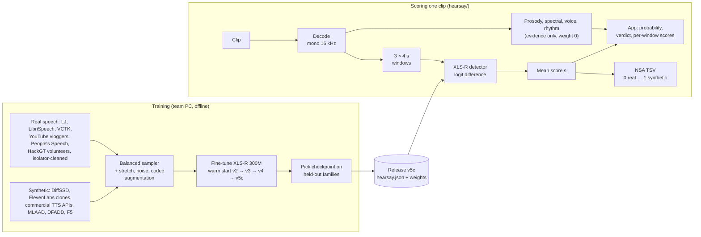
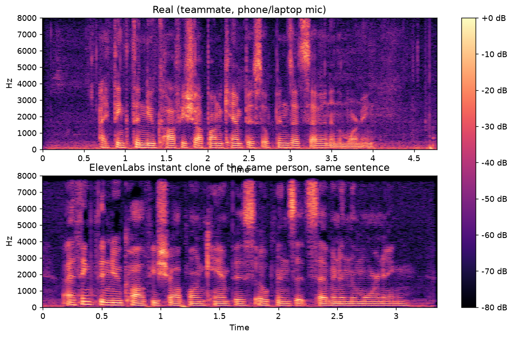

# Wizard: deepfake audio detector (HackGT 13, NSA HEARSAY, Team Gemini)

A desktop wizard that tells you how likely it is that a clip of speech is AI-generated, and shows the evidence
behind that answer. The same `hearsay/` code produces our NSA HEARSAY submission (`python -m hearsay predict`),
serves the app's API (`server/`) and ships in the Docker image (`docker/`).

- Contributors: start with [AGENTS.md](AGENTS.md), then [docs/STATUS.md](docs/STATUS.md).
- How a clip is scored and how the model was trained, with diagrams: [docs/ARCHITECTURE.md](docs/ARCHITECTURE.md).
- Head-to-head on the In-the-Wild benchmark against open-source detectors: [docs/benchmarks/in-the-wild.md](docs/benchmarks/in-the-wild.md).
- API contract: [docs/INTERFACES.md](docs/INTERFACES.md). Every decision, dated: [docs/DECISIONS.md](docs/DECISIONS.md).
- What NSA told us and what we inferred: [docs/CHALLENGE.md](docs/CHALLENGE.md). Model details: [ml/README.md](ml/README.md).

## Highlights

- **We diagnosed our own interim miss.** Our interim scored minDCF 0.258 (final: 0.1027). Per-analyzer contributions showed why: on
  ElevenLabs clones the network said "fake" (+2.8), while our hand-built feature models said "real" (-3.2, -2.0) and
  won. The final system lets the network decide, and the features only explain its verdict.
  [What we learned](#what-we-learned-the-short-version-of-docsdecisionsmd)
- **We worked out what NSA's real clips are, without labels.** Three independent models place the low-score cluster of
  the test set on VCTK recordings, not LJ Speech, and that cluster is about 70% of the clips, matching NSA's statement.
  So we chose the final model by how well it separates fakes from VCTK-like real speech.
  [How we chose the final system](#how-we-chose-the-final-system)
- **We attacked our own detector with ElevenLabs:** every TTS model, instant clones of 10 consenting volunteers we recruited at HackGT, the voice
  changer, voice design, codecs and the Voice Isolator. On held-out volunteers' clones, minDCF fell from 0.48 (v4) to
  0.18 (v5c); on 4 generator systems never seen in training it is 0.000. [Held-out results](docs/ARCHITECTURE.md#held-out-results-for-the-shipped-network)
- **We tested NSA's hints and kept only what held up.** Clones breathe as often as the real speakers, and spectrogram
  "ribs" flip direction between mic and studio audio, so we don't score on either. Clones speaking about 29% faster held up on same-sentence pairs, so the app
  shows it as evidence. [NSA's hints](#what-we-learned-the-short-version-of-docsdecisionsmd)
- **One pipeline, explained end to end.** The same `hearsay/` code writes the NSA TSV, runs the live server and ships
  in Docker. Every app report shows per-window scores, what each analyzer found, and its limitations, including our
  known weakness: isolator-cleaned real speech. [Architecture diagrams](docs/ARCHITECTURE.md)

## Results

| Submission | System | minDCF (P(synthetic) 0.3, false alarm 4x) | EER |
|---|---|---|---|
| Interim (Sat 16:10) | v4p6: XLS-R network + 5 hand-built analyzers, fused | 0.258 | 10.2% |
| **Final (Sun)** | v5c: XLS-R network alone (profile `nn`), trained on the diverse mix below | **0.1027** | (not reported) |

The final cut the detection cost by 60% from the interim (NSA's announced minDCF; lower is better). NSA scores the
better of the two submissions, so 0.1027 is our result.

On our own held-out data (sources and generators excluded from training), pooled over 3,546 synthetic and 1,364 real
clips, the final network scores minDCF 0.157, EER 2.86% and AUC 0.9966, against 0.191 / 4.03% / 0.9934 for the interim
network. NSA's test set turned out easier for v5c than our held-out mix (0.1027 vs 0.157), so our held-out numbers
are conservative. The breakdown by generator family is in [docs/ARCHITECTURE.md](docs/ARCHITECTURE.md#held-out-results-for-the-shipped-network).

### Benchmark: In-the-Wild

On the standard real-world benchmark In-the-Wild, restricted to the 16 speakers no model of ours trained on (6,567
clips), with 95% intervals from a speaker-level bootstrap:

| Model | Size | EER | minDCF |
|---|---|---|---|
| **v5c (ours)** | 300M | **0.50%** (0.2-1.0) | **0.020** (0.004-0.044) |
| AntiDeepfake XLS-R-1B (NII research model) | 1B | 0.67% (0.5-0.9) | 0.029 (0.014-0.040) |
| AntiDeepfake MMS-300M | 300M | 2.23% (1.2-3.0) | 0.107 (0.064-0.150) |
| Stock wav2vec2-base download (our server's stand-in) | 95M | 14.6% (5.5-25.8) | 0.814 (0.197-1.000) |

v5c ties a research model about 3x its size and clearly beats the same-size model
and the stock download. Details, per-speaker results and how to reproduce: [docs/benchmarks/in-the-wild.md](docs/benchmarks/in-the-wild.md).

The final system was chosen on held-out data only (never on NSA's test labels, which we do not have). See
"How we chose the final system" below.

## How it works



Full diagrams, with every data source, its sampling share and the training settings, are in
[docs/ARCHITECTURE.md](docs/ARCHITECTURE.md).

1. **Decode** any common audio format, mono, 16 kHz (`hearsay/audio.py`; long inputs are capped at 121 s).
2. **Neural detector** (`hearsay/analyzers/dl_detector.py`): wav2vec 2.0 XLS-R 300M, fine-tuned end to end as a
   binary classifier on a deliberately diverse mix (below). Clips are scored in up to three 4 s windows; its logit
   difference is the score. In the final release (profile `nn`) **this network alone sets the ranking.**
3. **Evidence analyzers** (prosody, spectral, voice quality, rhythm): interpretable measurements such as pitch
   movement, spectral tilt, formant motion and speaking rate. In profile `nn` they are still run and shown in the app
   with `role: "evidence"`, but they carry zero weight. The story of why is below.
4. **Response** (`hearsay/orchestrator.py`): score, calibrated probability, per-window scores, every analyzer's
   finding, channel notes and plain-language limitations.

## What we learned (the short version of docs/DECISIONS.md)

**1. Hand-built features overruled the network on exactly the hardest audio.** Our first releases fused the network
with five gradient-boosted feature models (`ml/fit_fusion.py`). On DiffSSD validation that looked perfect (minDCF
0.000 clean). The interim score (0.258) said otherwise. Per-analyzer contributions (`ml/analysis/eval/contrib_clones.py`)
showed why: on ElevenLabs clones of our consenting HackGT volunteers the network said "fake" (+2.8), while the spectral and
prosody models, trained on DiffSSD's generators, said "real" (-3.2 and -2.0) and won. On NSA's test set the fusion
called 134 clips "real" that the network scored as confidently fake.

**2. NSA's real clips look like VCTK, not LJ Speech.** For three independent networks, the low-score cluster of the
test set sits exactly where VCTK read speech sits, and not where LJ Speech, LibriSpeech, YouTube vloggers or our
HackGT volunteers sit (`ml/analysis/eval/cmp_v5c0.py`). That cluster is ~72% of the clips, matching NSA's "about 70% real".
v4 scored VCTK-like speech high, which is where the interim's false alarms came from.

**3. We tested every ElevenLabs avenue we could make** (`ml/analysis/el/el_matrix.py`, `sts_gen.py`, `el_extra.py`;
stock voices and consenting HackGT volunteers only). Plain TTS from every model (v3, Multilingual v2, Flash, Turbo), audio
tags, speed changes, raw PCM, 8 kHz mu-law and low-bitrate mp3 were all caught (minDCF 0.000 for the network).
The hard ones were instant voice clones (web-app clones 0.213), voice design (0.048) and the voice changer (0.037).
ElevenLabs' Voice Isolator makes *real* speech look fake to every model we tried (the same real clip moved from -16
to +4). We treat isolator-cleaned speech as real and trained on it.

**4. We tested NSA's hints and kept only what held up** (`ml/analysis/features/hint_feats.py`, 20 features, 2,160
clips, 5 independent comparisons). A useful cue must point the same way everywhere. None did:
- "AI doesn't breathe": the volunteers' clones breathe as often as the people themselves (AUC 0.50); the voice changer
  breathes more (0.74), because it keeps the human's breaths.
- "Spectrogram ribs" (harmonic structure): the direction flips between mic recordings and studio audio (0.75 vs 0.22),
  and cleaning real speech with the isolator moves it the same way. It measures recording cleanliness, not synthesis.
- Clones speak faster: true for our HackGT volunteers (+29% syllables/s, 92% of 100 same-sentence pairs, p = 1e-17), but it
  overlaps heavily with real fast talkers. We use it only as app evidence and as a reference check when a known
  real recording of the speaker is available.



*A HackGT volunteer reading one sentence (top) and an ElevenLabs instant clone of their voice reading it (bottom). The clone
is shorter (3.3 s vs 4.7 s) and has almost no energy above about 7.7 kHz. Its harmonics ("ribs") are
cleaner than the laptop-mic recording, but isolator-cleaned real speech looks the same, which is why we did not score on them.*

**5. Data diversity beat architecture** (NSA's own advice, and the recent literature). v5c adds, each with a held-out
slice: VCTK reals, TalkingFace YouTube vloggers (with demographics), Unsupervised People's Speech (English speech
only, via Whisper language ID + ASR check), YouTube reals, isolator-cleaned reals, the HackGT volunteers' reals; and on the fake
side 18 commercial TTS systems (ElevenLabs, OpenAI, Gemini, Cartesia, DeepGram, MiniMax, Inworld, Rime, Resemble,
Hume, Edge/Azure, Polly, Speechify, and Grok via xAI's API), 19 new MLAAD systems (4 held out entirely), DFADD,
F5-TTS clones and all our ElevenLabs material. Commercial systems had been ~0.02% of the training signal each; in v5c
they are 12% of the fake class together, ElevenLabs another 15%.

## How we chose the final system

Candidates: v4, v5c (each epoch), NII's AntiDeepfake XLS-R-1B and MMS-300M (zero-shot, loaded without fairseq in
`ml/analysis/eval/antideepfake.py`), and 2-3 model ensembles. Proxy: minDCF of each fake family against VCTK reals,
plus all fake families against all other reals (family-balanced so 2,000 DiffSSD clips cannot outvote 14 clips of one
speaker), plus a check that a 2-component mixture fitted to each model's NSA-test scores gives a ~30% fake share.
Held-out minDCF, each fake family against VCTK reals (lower is better; "all reals" pools every other real source):

| System | ElevenLabs (mixed) | Volunteer clones | Commercial TTS | DFADD | 4 unseen MLAAD systems | All fakes vs all reals | NSA fake share* |
|---|---|---|---|---|---|---|---|
| v4 (interim network) | 0.237 | 0.480 | 0.070 | 0.133 | 0.007 | 0.075 | 0.36 |
| AntiDeepfake XLS-R-1B | 0.377 | 0.605 | 0.147 | 0.047 | 0.027 | 0.094 | 0.27 |
| **v5c, epoch 1 (final)** | **0.087** | **0.180** | **0.017** | 0.093 | **0.000** | **0.055** | **0.29** |
| v5c, epoch 2 | 0.087 | 0.195 | 0.017 | 0.087 | 0.000 | 0.053 | 0.34 |
| 2 x v5c + AntiDeepfake | 0.233 | 0.462 | 0.063 | 0.033 | 0.000 | 0.058 | 0.27 |

\* Share of NSA test clips in the upper component of a 2-Gaussian fit to the system's scores; NSA says about 30% are
synthetic. Averaging with AntiDeepfake helped DFADD but diluted v5c's clone detection, so v5c alone was chosen; its
first epoch matched the stated 30% best. Caveat: v5c's VCTK, DFADD and commercial held-out slices are split by clip,
not by speaker or system, so they flatter v5c; the four MLAAD systems it never saw and the held-out volunteers are the
clean tests, and it wins both.

## Reproduce

```bash
# NSA TSV (row order and header are copied from NSA's template); FP32 avoids bf16 score ties
HEARSAY_FP32=1 MODEL_DIR=/models/v5c python -m hearsay predict HackGTHearsayTesting/ -o HearsayScoreKey4Gemini.tsv \
    --template HearsayScoreKey4TeamX.tsv --profile nn
python -m hearsay validate HearsayScoreKey4Gemini.tsv --template HearsayScoreKey4TeamX.tsv
# package a network as a release (Platt calibration, sha256 of every file, pins profile nn)
python ml/make_release_nn.py <checkpoint.pt> <val_scores.npz> /models/v5c v5c
# train v5c (data lists from ml/analysis/train/prep_v5c.py; warm start from v4)
python ml/analysis/train/train_v5c.py --run v5c --init data/checkpoints/v4/best.pt --epochs 3 \
    --samples-per-epoch 36000 --lr-backbone 1e-6 --lr-head 1e-4 --seed 13
```

Training and every analysis above are in `ml/analysis/` (paths assume the team PC's `~/hackgt` layout).
Weights, audio and API keys are never committed.

## Data, consent and licenses

- Voices were cloned only from 10 people we recruited at HackGT who agreed to it, and from ElevenLabs stock or Voice Design voices. We never clone
  public figures. The NSA test set was never uploaded to any third party.
- DiffSSD (CC BY-NC-ND), MLAAD (CC BY-NC), TalkingFace (CC BY-NC), AntiDeepfake weights (CC BY-NC-SA) and
  ASVspoof data are non-commercial: this project is too, and none of that data is redistributed.

## Limitations

- Isolator-cleaned or heavily enhanced real speech still scores high on every model we tried.
- A single "likely synthetic" result is a lead, not proof. The app says so on every report.
