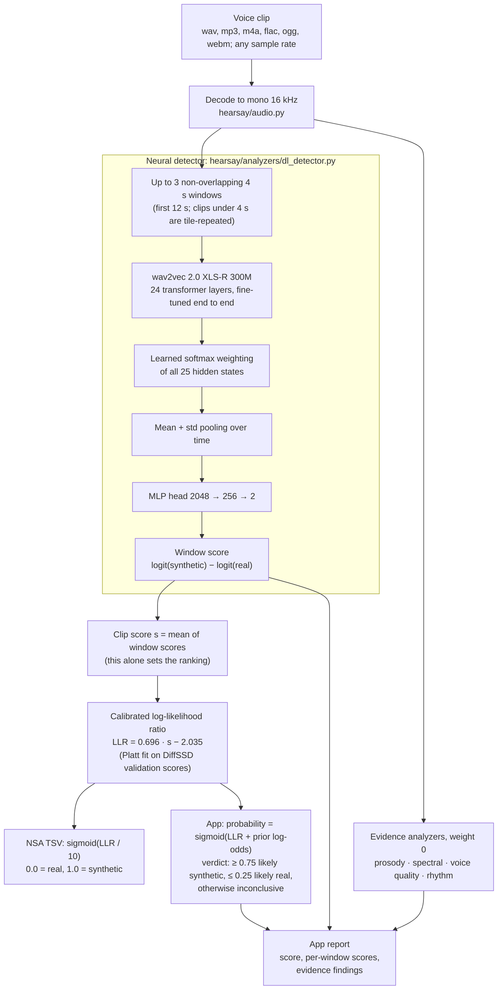
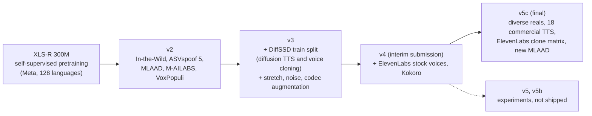
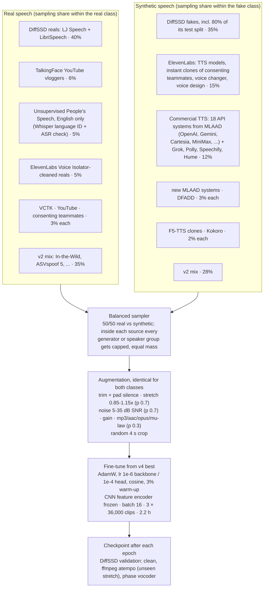
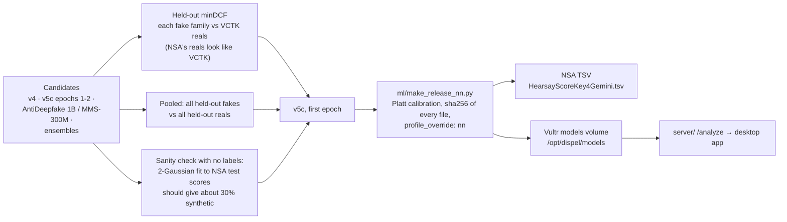

# Architecture: how a clip is scored, and how the model was trained

Two halves meet at one folder: the **release** (`hearsay.json` plus weights). Training produces it on the team PC,
and everything that scores audio loads it: the NSA TSV (`python -m hearsay predict`), the Vultr server (`server/`)
and the Docker image. All three use the same `hearsay/` code, so the app scores a clip exactly as the submission did.

## 1. Scoring one voice clip (release v5c, profile `nn`)

What each part is for:

| Step | Why it is there |
|---|---|
| 16 kHz mono decode | XLS-R was pretrained on 16 kHz audio, and NSA's test set is 16 kHz. |
| 4 s windows, up to 3 | Training crops were 4 s. Averaging three windows steadies the score, and the app shows each window's score so a spliced clip stands out. |
| Weighted mix of all layers | The top layer is tuned for speech content, not recording artifacts. A learned weight per layer lets the head use whichever layers separate real from synthetic. |
| Mean + std pooling | The std term captures how the frames vary over time, not just their average. |
| One network, no fusion | In the interim release, hand-built feature models outvoted the network on ElevenLabs clones. Now they only explain the verdict (see [DECISIONS.md](DECISIONS.md), Sat 18:40). |
| `sigmoid(LLR / 10)` for the TSV | minDCF depends only on the ranking. The gentle squash keeps every clip distinct: no ties at 0 or 1. We score in full precision (`HEARSAY_FP32=1`) so that bf16 rounding creates no ties either. |

## 2. How the model was trained

Each generation warm-starts from the previous best checkpoint and adds the data the previous one failed on.

### The v5c training run (`ml/analysis/train/train_v5c.py`)

Held out from training entirely, so they give honest numbers: 4 MLAAD systems (Higgs-Audio-V3, Index-TTS-2.0,
Step-Audio-EditX, supertonic-3), 6 Grok voices, a speaker-disjoint set of teammates (real voices and their clones),
20% of DiffSSD's test split, and a slice of every other source. Epoch 3 was checked on DiffSSD validation only
(slightly worse), so it was not a candidate.

### Choosing the checkpoint and shipping it

NSA's test labels were never available to us, and the test audio was never used for training or uploaded to
any third party. The mixture check reads only the shape of our own score distribution.

## Held-out results for the shipped network

minDCF with P(synthetic) = 0.3 and a false alarm costing 4x a miss (the challenge metric; lower is better).

| Test set (never trained on) | v4 (interim) | v5c (final) |
|---|---|---|
| All held-out fakes (3,546) vs all held-out reals (1,364): AUC | 0.9934 | **0.9966** |
| same: EER | 4.03% | **2.86%** |
| same: minDCF | 0.191 | **0.157** |
| ElevenLabs, mixed methods, vs VCTK reals | 0.237 | **0.087** |
| Consenting teammates' instant clones vs VCTK reals | 0.480 | **0.180** |
| 4 MLAAD systems never seen | 0.007 | **0.000** |
| New clips we generated from the Gemini (13) and Inworld (61) APIs after training* | n/a | **0.000** |
| Teammates' real recordings flagged at VCTK's 1% false-alarm threshold | n/a | **0** |
| Isolator-cleaned real speech flagged at the same threshold | 41% | 47% |

\* The clips are new, but both systems appear in MLAAD's commercial set, which v5c trained on. This row shows that
the network generalizes to new sentences and voices, not to new systems; the 4 unseen MLAAD systems test that.

The last row is the known weakness: speech run through a noise remover looks synthetic to every model we tried
(see Limitations in the [README](../README.md)).
